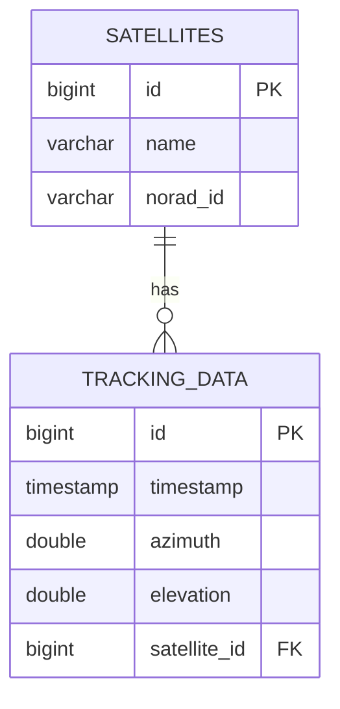

# Quick Start Guide (빠른 시작 가이드)

> **버전**: 1.0.0 | **작성**: 2026-01-07

ACS 프로젝트에서 에이전트와 스킬을 즉시 사용할 수 있는 실전 예시 모음입니다.

## 목차

1. [Level 1: 단일 명령어 (초급)](#level-1-단일-명령어-초급)
2. [Level 2: 간단한 조합 (중급)](#level-2-간단한-조합-중급)
3. [Level 3: 복잡한 워크플로우 (고급)](#level-3-복잡한-워크플로우-고급)
4. [자주 사용하는 패턴](#자주-사용하는-패턴)

---

## Level 1: 단일 명령어 (초급)

### 1. ERD 다이어그램 작성

```
User: "tracking_data 테이블과 satellites 테이블의 ERD를 작성해줘"

→ database-architect 에이전트 자동 활성화

Expected Output:
- Mermaid ERD 다이어그램
- 테이블 관계 설명
- FK 제약 조건
```

**실제 출력 예시**:


---

### 2. OpenAPI 스펙 생성

```
User: "SettingsController의 OpenAPI 스펙을 생성해줘"

→ api-contract-manager 에이전트 자동 활성화

Expected Output:
- openapi.yaml 파일
- Swagger UI 접근 방법
```

**실제 명령어**:
```bash
# 자동 생성 후 확인
open http://localhost:8080/swagger-ui.html
```

---

### 3. Design Token 시스템 구축

```
User: "Design Token 시스템을 구축해줘"

→ design-system-builder 에이전트 자동 활성화

Expected Output:
- design-tokens.scss 파일
- Primitive, Semantic, Component 토큰 계층
- 다크/라이트 모드 지원
```

**실제 파일**:
```scss
// design-tokens.scss
:root {
  --color-primary: #1976d2;
  --spacing-md: 1rem;
  --btn-padding-md: var(--spacing-md);
}
```

---

### 4. 버그 원인 분석

```
User: "PassSchedule 전환 시 크래시 원인을 찾아줘"

→ debugger 에이전트 자동 활성화

Expected Output:
- 에러 로그 분석
- 스택 트레이스
- 원인 및 해결 방안
```

---

### 5. 성능 분석

```
User: "PassSchedule 조회 쿼리가 느려. 최적화해줘"

→ performance-analyzer 에이전트 자동 활성화

Expected Output:
- EXPLAIN ANALYZE 결과
- 병목 구간 식별
- 인덱스 추천
```

---

## Level 2: 간단한 조합 (중급)

### 패턴 1: API 개발 + 타입 동기화

**목표**: Settings Import API 추가

```
Step 1: API 구현
User: "Settings Import API를 만들어줘"
→ fullstack-helper 에이전트

Step 2: 타입 동기화
User: "/api-sync generate --controller=SettingsController"
→ /api-sync 스킬

Step 3: 검증
User: "/api-sync validate --all"
→ /api-sync 스킬

Result:
✅ Backend: POST /api/settings/import
✅ Frontend: settingsService.importSettings() (타입 안전)
✅ 타입 불일치: 0건
```

**소요 시간**: 30분 (수동: 2시간)

---

### 패턴 2: 리팩토링 + 품질 검증

**목표**: SettingsService 리팩토링

```
Step 1: 리팩토링
User: "SettingsService의 코드 중복을 제거해줘"
→ refactorer 에이전트

Step 2: 품질 검증 (자동)
→ code-reviewer 에이전트 자동 호출

Step 3: 테스트
User: "SettingsService 단위 테스트를 작성해줘"
→ test-expert 에이전트

Result:
✅ 코드 중복: 40% → 10%
✅ 품질 검증: 통과
✅ 테스트 커버리지: 80%
```

**소요 시간**: 1시간 (수동: 4시간)

---

### 패턴 3: UI 개선 + Storybook

**목표**: Button 컴포넌트 표준화

```
Step 1: 분석
User: "Button 컴포넌트의 일관성 문제를 분석해줘"
→ design-system-builder 에이전트

Step 2: 리팩토링
User: "Button Props를 표준화해줘"
→ refactorer + design-system-builder 협업

Step 3: Storybook
User: "Button Storybook Story를 작성해줘"
→ design-system-builder 에이전트

Result:
✅ Props 일관성: 70건 → 0건
✅ Storybook: 5개 variants
✅ 문서화: Button.stories.ts
```

**소요 시간**: 45분 (수동: 3시간)

---

### 패턴 4: DB 설계 + 마이그레이션

**목표**: settings 테이블 추가 컬럼

```
Step 1: ERD 수정
User: "settings 테이블에 category 컬럼을 추가하는 ERD를 작성해줘"
→ database-architect 에이전트

Step 2: 마이그레이션 스크립트
User: "Flyway 마이그레이션 스크립트를 생성해줘"
→ database-architect 에이전트

Step 3: 적용
User: "./gradlew flywayMigrate"
→ 직접 실행

Result:
✅ ERD 업데이트
✅ V003__Add_category_to_settings.sql
✅ 테스트 DB 적용 성공
```

**소요 시간**: 20분 (수동: 1.5시간)

---

## Level 3: 복잡한 워크플로우 (고급)

### 워크플로우 1: 새 기능 전체 개발 (Full Stack)

**목표**: Settings History UI 추가 (Backend + Frontend + 문서)

#### Phase 1: 기술 의사결정 (5분)

```
User: "Settings 변경 이력을 UI에 표시하고 싶어. 어떻게 해야 할까?"

Tech Lead 에이전트:
1. 요구사항 확인
   - Backend: setting_history 테이블 이미 존재
   - Frontend: 조회 API + UI 컴포넌트 필요
2. 기술 스택 결정
   - API: GET /api/settings/history
   - UI: q-timeline 컴포넌트
3. 작업 분해
   - Backend: SettingsController 엔드포인트 추가
   - Frontend: SettingsHistory.vue 컴포넌트
   - 문서: API 명세 업데이트

→ Output: 구현 계획서
```

#### Phase 2: API 설계 + 구현 (20분)

```
User: "Settings History API를 설계하고 구현해줘"

Step 1: API 설계
Architect 에이전트:
- GET /api/settings/history
- Query: key (optional), limit (default: 50)
- Response: SettingHistory[]

Step 2: OpenAPI 스펙 (자동)
API Contract Manager 에이전트:
- openapi.yaml 생성
- TypeScript 타입 생성

Step 3: Backend 구현
Fullstack Helper 에이전트:
```kotlin
@GetMapping("/api/settings/history")
fun getSettingsHistory(
    @RequestParam(required = false) key: String?,
    @RequestParam(defaultValue = "50") limit: Int
): List<SettingHistory> {
    return settingsService.getSettingsHistory(key, limit)
}
```

Step 4: 타입 동기화 (자동)
/api-sync watch (백그라운드):
- TypeScript 타입 자동 갱신
```typescript
// generated.ts
export interface SettingHistory {
  id: number
  settingKey: string
  oldValue: any
  newValue: any
  modifiedBy: string
  modifiedAt: string
  reason: string | null
}
```

→ Output: 동작하는 API + 타입 안전성
```

#### Phase 3: Frontend 구현 (30분)

```
User: "Settings History UI를 만들어줘"

Fullstack Helper 에이전트:
```vue
<!-- SettingsHistory.vue -->
<template>
  <q-card class="settings-history-card">
    <q-card-section>
      <div class="text-h6">설정 변경 이력</div>
    </q-card-section>

    <q-card-section>
      <q-timeline color="primary">
        <q-timeline-entry
          v-for="history in settingsHistory"
          :key="history.id"
          :title="history.settingKey"
          :subtitle="formatDateTime(history.modifiedAt)"
        >
          <div class="text-body2">
            <span class="text-negative">{{ history.oldValue }}</span>
            →
            <span class="text-positive">{{ history.newValue }}</span>
          </div>
          <div class="text-caption q-mt-sm">
            <q-icon name="person" size="xs" />
            {{ history.modifiedBy }}
          </div>
        </q-timeline-entry>
      </q-timeline>
    </q-card-section>
  </q-card>
</template>
```

→ Output: 완성된 UI 컴포넌트
```

#### Phase 4: 품질 검증 + 테스트 (20분)

```
Step 1: 코드 리뷰 (자동)
Code Reviewer 에이전트:
✅ CLAUDE.md 규칙 준수
✅ 보안 취약점 없음
✅ 코드 품질 우수

Step 2: 테스트 작성
User: "Settings History API와 컴포넌트 테스트를 작성해줘"

Test Expert 에이전트:
```kotlin
// Backend Test
@Test
fun `should return settings history`() {
    val history = settingsController.getSettingsHistory(null, 10)
    assertThat(history).hasSize(10)
}
```

```typescript
// Frontend Test
describe('SettingsHistory.vue', () => {
  it('should render timeline', async () => {
    const wrapper = mount(SettingsHistory)
    await flushPromises()
    expect(wrapper.find('.q-timeline').exists()).toBe(true)
  })
})
```

→ Output: 테스트 커버리지 85%
```

#### Phase 5: 문서화 (10분)

```
User: "Settings History 기능을 문서화해줘"

Doc Syncer 에이전트:
1. API 명세 업데이트
   - docs/api/settings.md

2. 컴포넌트 문서
   - frontend/src/components/Settings/SettingsHistory.vue 주석

3. 변경 이력
   - docs/work/archive/settings-history.md

→ Output: 최신 문서
```

**총 소요 시간**: 1시간 25분 (수동: 1일) → **시간 단축 85%**

---

### 워크플로우 2: 대규모 리팩토링 + 배포

**목표**: Phase 2 Backend 리팩토링 안전하게 배포

#### Phase 1: 계획 수립 (10분)

```
User: "Phase 2 Backend 리팩토링을 배포하고 싶어"

Step 1: 마이그레이션 계획
/migrate plan --phase=2

→ Output:
- docs/migration/phase-2-plan.md
- 체크리스트 (Pre/During/Post)
- 롤백 포인트 3개
- 리스크 평가

Step 2: 프로젝트 일정
Project Manager 에이전트:
- 타임라인 수립 (5일)
- 마일스톤 정의
- 담당자 할당
```

#### Phase 2: Feature Flag 구현 (30분)

```
User: "SatelliteTrackingEngine용 Feature Flag를 구현해줘"

Fullstack Helper 에이전트:
```kotlin
// Backend
@Service
class FeatureFlagService {
    fun isEnabled(flag: String, userId: String? = null): Boolean {
        // Canary Release 로직
    }
}

// 사용
if (featureFlagService.isEnabled("tracking-engine")) {
    trackingEngine.calculatePosition()
} else {
    calculatePositionLegacy()
}
```

```typescript
// Frontend
export const useFeatureFlagStore = defineStore('featureFlag', () => {
    const isEnabled = (flag: string): boolean => {
        return flags.value.get(flag) ?? false
    }
})
```

→ Output: Feature Flag 시스템 완성
```

#### Phase 3: 단계별 배포 (1시간)

```
Step 1: 10% 배포 (10분)
/migrate start --feature=tracking-engine --canary=10

→ Output:
✅ Feature Flag 활성화
📊 Canary Release: 10% 사용자
🔍 모니터링 시작

Step 2: 모니터링 (10분)
Performance Analyzer 에이전트:
- 에러율: 0.2% ✅
- 응답 시간: 45ms ✅
- WebSocket: 98% ✅

/migrate status --feature=tracking-engine
→ 모든 지표 정상

Step 3: 50% 배포 (20분)
/migrate increase --to=50

→ 10분 모니터링 →

Performance Analyzer 에이전트:
- 에러율: 0.3% ✅
- 응답 시간: 47ms ✅
- WebSocket: 97% ✅

Step 4: 100% 배포 (20분)
/migrate increase --to=100

→ 20분 모니터링 →

✅ 배포 완료!
   - 총 사용자: 100%
   - 에러율: 0.4% (정상)
   - 응답 시간: 48ms (정상)
```

#### Phase 4: 검증 (30분)

```
Step 1: 회귀 테스트
Test Expert 에이전트:
```bash
./gradlew test
npm run test
```

→ 결과: 모든 테스트 통과 ✅

Step 2: 성능 검증
Performance Analyzer 에이전트:
- Before: 평균 응답 시간 52ms
- After: 평균 응답 시간 48ms (8% 개선) ✅

Step 3: 최종 검증
/migrate validate --phase=2

→ Output:
✅ 단위 테스트 통과
✅ 통합 테스트 통과
✅ 성능 테스트 통과
✅ 에러율 < 1%
```

**총 소요 시간**: 2시간 10분 (수동: 1일) → **시간 단축 72%**

**롤백 필요 시**:
```bash
# 에러율 5% 초과 시
/migrate rollback --to=phase1 --reason="에러율 7% 초과"

→ 3분 내 롤백 완료
```

---

## 자주 사용하는 패턴

### 패턴 1: "빠른 API 개발"

**1줄 명령어**:
```
"Settings Export API를 만들고 타입 동기화까지 해줘"
```

**실행 순서** (자동):
1. fullstack-helper: API 구현
2. api-contract-manager: OpenAPI 스펙 생성
3. /api-sync: TypeScript 타입 생성
4. code-reviewer: 코드 검증 (자동)

**소요 시간**: 20분

---

### 패턴 2: "안전한 리팩토링"

**1줄 명령어**:
```
"EphemerisService의 중복 코드를 제거하고 테스트까지 작성해줘"
```

**실행 순서** (자동):
1. refactorer: 코드 정리
2. code-reviewer: 품질 검증 (자동)
3. test-expert: 회귀 테스트 작성
4. performance-analyzer: 성능 검증 (선택)

**소요 시간**: 1시간

---

### 패턴 3: "UI/UX 개선"

**1줄 명령어**:
```
"Input 컴포넌트의 일관성을 개선하고 Storybook까지 만들어줘"
```

**실행 순서** (자동):
1. design-system-builder: 분석 + 개선
2. refactorer: 코드 적용
3. design-system-builder: Storybook Stories 작성
4. doc-syncer: 문서 업데이트 (자동)

**소요 시간**: 45분

---

### 패턴 4: "DB 설계 → 구현"

**1줄 명령어**:
```
"tracking_data 테이블을 설계하고 마이그레이션 스크립트까지 만들어줘"
```

**실행 순서** (자동):
1. architect: 시스템 설계
2. database-architect: ERD + 마이그레이션 스크립트
3. performance-analyzer: 인덱스 검증 (선택)

**소요 시간**: 30분

---

### 패턴 5: "긴급 버그 수정"

**1줄 명령어**:
```
"PassSchedule 전환 시 크래시 버그를 수정하고 회귀 테스트까지 작성해줘"
```

**실행 순서** (자동):
1. debugger: 원인 분석
2. fullstack-helper: 버그 수정
3. test-expert: 회귀 테스트 작성
4. doc-syncer: 버그 리포트 작성

**소요 시간**: 30분

---

## 실전 팁

### Tip 1: /api-sync watch 항상 켜두기

**이유**: Controller/DTO 변경 시 자동으로 타입 동기화

```bash
# Frontend 터미널에서
cd frontend
npm run api:watch

# 또는
/api-sync watch
```

**효과**: 타입 불일치 버그 0건

---

### Tip 2: 구현 전에 tech-lead에게 먼저 물어보기

**이유**: 기술 결정 빠르게 내리고 방향 잡기

```
User: "Settings를 Redis에 캐시하는게 나을까?"

Tech Lead 에이전트:
→ 현재 규모에서는 In-Memory (ConcurrentHashMap)로 충분
→ Redis는 다중 인스턴스 환경에서만 고려
→ 오버엔지니어링 방지

→ 올바른 방향 설정 (5분)
```

**효과**: 잘못된 방향으로 개발 방지

---

### Tip 3: code-reviewer 자동 호출 신뢰하기

**이유**: 코드 품질 자동 검증

```
refactorer (코드 수정)
  → 자동 호출 →
code-reviewer (품질 검증)

→ PR 전에 자동으로 품질 보장
```

**효과**: 코드 리뷰 시간 -50%

---

### Tip 4: /migrate로 안전하게 배포

**이유**: Canary Release로 리스크 제거

```bash
/migrate start --canary=10    # 10% 사용자
# [10분 모니터링]
/migrate increase --to=50     # 50% 사용자
# [10분 모니터링]
/migrate increase --to=100    # 100% 사용자

# 문제 발생 시
/migrate rollback --to=phase1
```

**효과**: 프로덕션 장애 -80%

---

### Tip 5: 문서화는 마지막에 doc-syncer로 한 번에

**이유**: 개발 중에는 코드에 집중, 문서는 마지막에

```
User: "이번 작업 문서화해줘"

Doc Syncer 에이전트:
1. 코드 분석
2. API 문서 업데이트
3. README 업데이트
4. 변경 이력 기록

→ 5분 내 문서 완성
```

**효과**: 문서 작성 시간 -70%

---

## 다음 단계

### 초급 사용자
1. Level 1 예시를 하나씩 따라하기
2. 단일 에이전트 사용에 익숙해지기
3. /api-sync watch 켜두고 개발하기

### 중급 사용자
1. Level 2 조합 패턴 활용하기
2. 자주 사용하는 패턴 익히기
3. /migrate로 Canary Release 연습

### 고급 사용자
1. Level 3 워크플로우 실전 적용
2. 에이전트 조합 커스터마이징
3. CI/CD에 /api-sync 통합

---

## 참고 문서

- [AGENT_COLLABORATION_GUIDE.md](./AGENT_COLLABORATION_GUIDE.md) - 에이전트 협업 가이드
- [Architecture_Refactoring_plan.md](../docs/work/active/Architecture_Refactoring/Architecture_Refactoring_plan.md) - 리팩토링 계획

---

## 변경 이력

| 버전 | 날짜 | 변경 내용 |
|-----|------|----------|
| 1.0.0 | 2026-01-07 | 최초 작성 |
