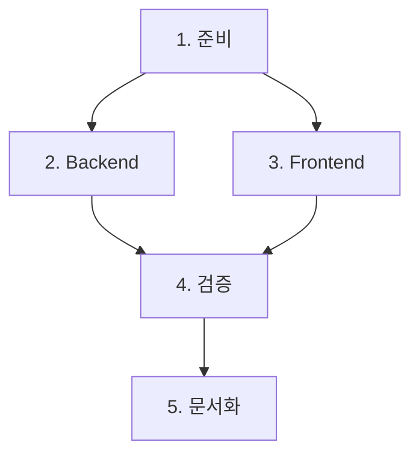

# Planning Work - 작업 계획 스킬 (v2.0)

> **통합 워크플로우**: [UNIFIED_WORKFLOW.md](./UNIFIED_WORKFLOW.md) 참조
> **검증 사례**: PassSchedule 상태머신 리팩토링 (15/17 완료, 88%)

## 역할

복잡한 작업을 분석하고 실행 가능한 단계별 계획으로 분해합니다.

**핵심 가치:**
- Phase A-D 분류로 우선순위 관리
- 전문가 에이전트 검토
- 문서 기반 추적 관리
- 실행 가능한 계획

## 워크플로우 (v2.0 - 통합)

```
[1. 조사] → [2. 검토] → [3. 계획] → [4. 승인] → [연계 스킬]
     │           │           │           │           │
  요구사항     전문가      PLAN.md    사용자     /feature
  분석        에이전트     작성       확인      /refactor
     │           │           │                  /bugfix
     ▼           ▼           ▼
  범위 정의   tech-lead   Phase A-D
             architect    분류
```

## 실행 단계

### Step 1: 요청 분석

```yaml
분석 항목:
  - 무엇을 달성하려 하는가? (목표)
  - 왜 필요한가? (동기)
  - 현재 상태는? (시작점)
  - 완료 기준은? (종료 조건)
```

### Step 2: 범위 정의

```yaml
영향 범위 분석:
  Backend:
    - Controller 변경 필요?
    - Service 변경 필요?
    - Algorithm 변경 필요?
    - Model/DTO 변경 필요?

  Frontend:
    - Page 변경 필요?
    - Component 변경 필요?
    - Store 변경 필요?
    - Type 변경 필요?

  문서:
    - API 문서 업데이트?
    - concepts/ 문서 업데이트?
    - 새 ADR 필요?
```

### Step 3: 작업 분해 (WBS)

```markdown
## 작업 분해 구조

### Phase 1: 준비
- [ ] 1.1 요구사항 확정
- [ ] 1.2 기존 코드 분석
- [ ] 1.3 설계 문서 작성

### Phase 2: Backend 구현
- [ ] 2.1 Model/DTO 정의
- [ ] 2.2 Service 구현
- [ ] 2.3 Controller 구현
- [ ] 2.4 테스트 작성

### Phase 3: Frontend 구현
- [ ] 3.1 Type 정의
- [ ] 3.2 Store 구현
- [ ] 3.3 Component 구현
- [ ] 3.4 Page 통합

### Phase 4: 검증
- [ ] 4.1 단위 테스트
- [ ] 4.2 통합 테스트
- [ ] 4.3 E2E 테스트

### Phase 5: 문서화
- [ ] 5.1 API 문서 업데이트
- [ ] 5.2 사용자 가이드 업데이트
- [ ] 5.3 ADR 작성 (해당시)
```

### Step 4: 의존성 분석

```yaml
의존성 그래프:
  1.1 요구사항 확정
    └── 1.2 기존 코드 분석
        └── 1.3 설계 문서 작성
            ├── 2.1 Model/DTO 정의
            │   └── 2.2 Service 구현
            │       └── 2.3 Controller 구현
            └── 3.1 Type 정의
                └── 3.2 Store 구현
                    └── 3.3 Component 구현

병렬 가능 작업:
  - 2.x (Backend)와 3.x (Frontend)는 병렬 진행 가능
  - 단, 3.2 Store는 2.3 Controller API 확정 후
```

### Step 5: 계획 출력

```markdown
# {작업명} 실행 계획

## 개요

| 항목 | 내용 |
|------|------|
| 목표 | {달성하려는 것} |
| 범위 | Backend, Frontend |
| 복잡도 | 높음 / 중간 / 낮음 |

## 작업 순서



## 체크리스트

### 즉시 시작 가능
- [ ] 요구사항 확정
- [ ] 기존 코드 분석

### 의존성 있음
- [ ] Service 구현 (← Model 정의 후)
- [ ] Store 구현 (← API 확정 후)

### 병렬 진행 가능
- [ ] Backend 구현 || Frontend 구현

## 리스크 및 주의사항

| 리스크 | 영향 | 대응 |
|--------|------|------|
| {리스크 1} | 높음/중간/낮음 | {대응 방안} |

## 완료 기준

- [ ] 모든 기능 구현 완료
- [ ] 테스트 100% 통과
- [ ] 문서 업데이트 완료
- [ ] 코드 리뷰 완료
```

## 계획 템플릿

### 소규모 작업 (1-2 파일)

```markdown
## {작업명} 계획

### 할 일
1. [ ] {작업 1}
2. [ ] {작업 2}

### 영향 파일
- `{파일1}`
- `{파일2}`

### 완료 기준
- [ ] {기준}
```

### 중규모 작업 (3-10 파일)

```markdown
## {작업명} 계획

### 목표
{설명}

### 작업 분해
#### Phase 1: 준비
- [ ] ...

#### Phase 2: 구현
- [ ] ...

#### Phase 3: 검증
- [ ] ...

### 영향 범위
| 영역 | 파일 | 변경 유형 |
|------|------|----------|
| | | |

### 리스크
- {리스크}

### 완료 기준
- [ ] ...
```

### 대규모 작업 (10+ 파일)

→ `/feature` 스킬 사용 권장
→ 전체 문서 구조 생성 (README, DESIGN, PROGRESS)

## 호출 에이전트

| 에이전트 | 역할 | 호출 시점 |
|---------|------|---------|
| `project-manager` | 작업 분해 | 메인 |
| `architect` | 설계 검토 | 복잡한 작업 |
| `tech-lead` | 방향 결정 | 대규모 작업 |

## 사용 예시

### 예시 1: 간단한 기능

```
사용자: "버튼 색상 변경 어떻게 할까?"

→ /plan:

## 버튼 색상 변경 계획

### 할 일
1. [ ] CSS 변수 확인 (var(--theme-*))
2. [ ] 해당 컴포넌트 스타일 수정

### 영향 파일
- `frontend/src/components/MyButton.vue`

### 완료 기준
- [ ] 색상 변경 확인
- [ ] 다른 버튼 영향 없음
```

### 예시 2: 중간 규모

```
사용자: "Pass Schedule에 필터 기능 추가 계획 세워줘"

→ /plan:

## PassSchedule 필터 기능 계획

### 목표
사용자가 특정 조건으로 스케줄 필터링

### 작업 분해

#### Phase 1: 준비
- [ ] 필터 조건 정의 (위성명, 시간대, 최소 고도)
- [ ] UI 디자인 결정

#### Phase 2: Backend
- [ ] PassScheduleService에 필터 메서드 추가
- [ ] API 엔드포인트 추가

#### Phase 3: Frontend
- [ ] 필터 컴포넌트 생성
- [ ] passScheduleStore에 필터 상태 추가
- [ ] PassSchedulePage에 통합

#### Phase 4: 검증
- [ ] 필터 조합 테스트
- [ ] 성능 테스트 (대량 데이터)

### 의존성
- Backend API 확정 → Frontend Store 구현

### 완료 기준
- [ ] 3가지 필터 조건 동작
- [ ] 복합 필터 지원
- [ ] 100개+ 스케줄에서 성능 OK
```

### 예시 3: 대규모

```
사용자: "실시간 알람 시스템 계획"

→ "대규모 작업으로 판단됩니다."
→ "/feature 스킬을 사용하여 전체 문서 구조를 생성하시겠습니까?"

[예] → /feature 호출
[아니오] → 간략 계획 제공
```

## 트러블슈팅

### Q: 작업 범위를 모르겠어요
A: 먼저 관련 코드를 분석 (Explore 에이전트 사용)

### Q: 의존성이 복잡해요
A: 의존성 그래프 그리고 병렬 가능한 부분 식별

### Q: 계획 후 변경이 생겼어요
A: 계획 업데이트하고 Why 기록 (왜 변경했는지)

---

**스킬 버전:** 2.0.0
**작성일:** 2026-01-20
**변경:** 통합 워크플로우 적용, Phase 분류 추가
**호환:** ACS 프로젝트 전용
